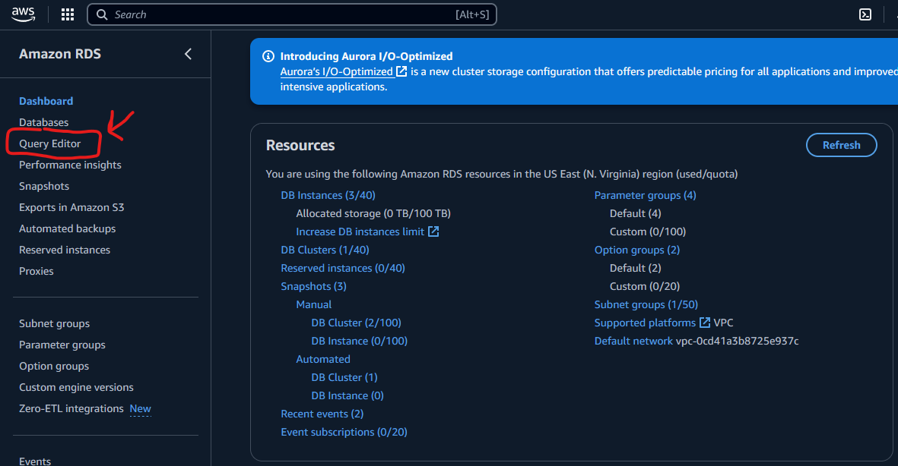
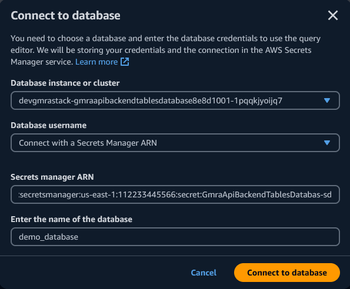
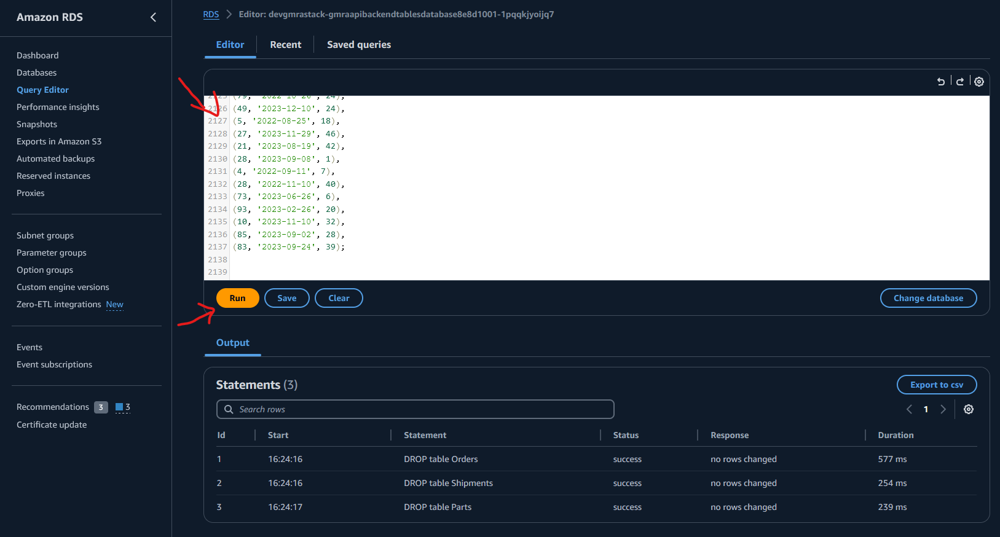
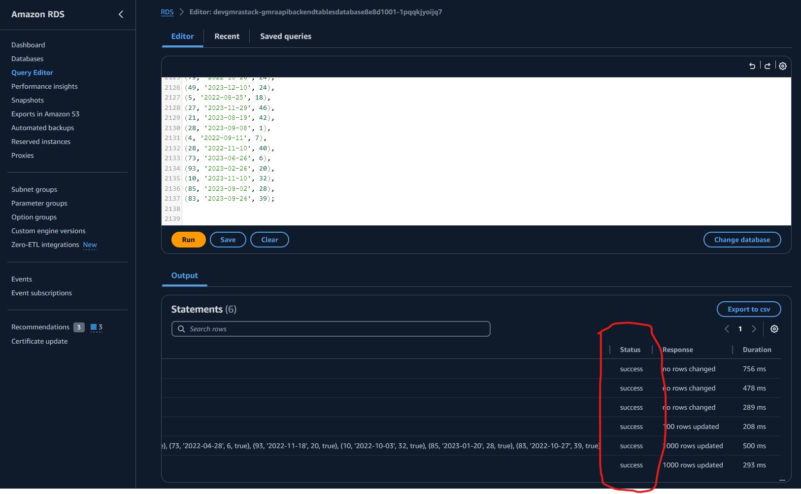

# Building a Serverless Supply Chain Management Solution for Automotive Customers with AWS AppSync and Amazon Aurora Serverles

In the automotive industry, effective supply chain management is critical to ensuring seamless operations, reducing costs, and meeting customer demands. Leveraging modern serverless technologies, you can build scalable, low-latency applications that simplify data management and enable real-time insights.

In this blog post, we’ll guide you through building a serverless supply chain management solution tailored for an automotive customer. We will use AWS AppSync for a GraphQL API to enable flexible, low-latency queries, and Amazon Aurora Serverless as the database for managing parts inventory, orders, and shipments. The solution will showcase how to model a relational database schema, implement GraphQL resolvers with JavaScript, and achieve scalability with serverless design patterns.

You will learn:

- How to model a relational database schema for supply chain management.
- How to use AWS AppSync to build a GraphQL API for querying and managing supply chain data.
- How to use Amazon Aurora Serverless for an on-demand, cost-efficient relational database.
- How to implement JavaScript resolvers in AppSync to handle complex business logic.

By the end of this post, you’ll have a working example of a supply chain management application and the knowledge to extend it to meet your business needs.

## Solution Architecture

This solution leverages AWS serverless technologies to create a scalable and cost-effective supply chain management system for the automotive industry. Below is an overview of the architecture and how the various components work together to manage parts inventory, orders, and shipments.
Architecture Diagram

The architecture includes:

- Amazon AppSync: A GraphQL API layer for querying and managing data.
- Amazon Aurora Serverless: A relational database to store inventory, orders, and shipments.
- AWS Lambda (optional): For custom logic that cannot be handled directly by AppSync resolvers.
- Amazon CloudWatch: To monitor performance and query execution.
- Amazon Cognito: For secure API authentication and authorization.

### Solution Workflow

1. GraphQL API with AppSync
   AWS AppSync provides a flexible GraphQL API for querying and modifying supply chain data. Using JavaScript resolvers, you can connect directly to Amazon Aurora Serverless to retrieve and manipulate data. AppSync simplifies data access by exposing a single endpoint for querying parts, orders, and shipments.

2. Relational Database with Aurora Serverless
   The data for the supply chain is stored in Amazon Aurora Serverless, an on-demand, auto-scaling relational database. The schema includes three key tables: Parts, Orders, and Shipments, designed to model the relationships and dependencies within the supply chain.

3. Business Logic with JavaScript Resolvers
   AppSync resolvers written in JavaScript handle complex business logic, such as:
   Calculating lead times between orders and shipments.
   Forecasting parts demand based on historical data.
   Managing inventory levels dynamically.

4. Authentication with Amazon Cognito
   Amazon Cognito secures access to the GraphQL API, ensuring that only authorized applications and services can interact with supply chain data. You can use Cognito to enforce role-based access control (RBAC) for different types of clients, such as warehouse management systems or supplier applications.

5. Monitoring and Logging with CloudWatch
   Amazon CloudWatch is used to monitor query execution and track performance metrics, such as latency and error rates. Logs generated by AppSync and Aurora provide insights into how the system performs under various workloads.

## Deployment

Step 1. Clone the repository.

```bash
git clone git@ssh.gitlab.aws.dev:obertoa/blog-supply-chain-automotive.git
```

Step 2. Move into the cloned repository.

```bash
cd blog-supply-chain-automotive
```

Step 3. Install the project dependencies and build the project.

```bash
npm install && npm run build
```

Step 4. (Optional) Generate types for GraphQL:

    Note: This is required if you want to use GraphQL types in the resolvers.

```bash
npm run codegen
```

Step 5. (Optional) Bootstrap AWS CDK on the target account and region

    Note: This is required if you have never used AWS CDK on this account and region combination. (More information on CDK bootstrapping).

```bash
npx cdk bootstrap aws://{targetAccountId}/{targetRegion}
```

Step 6. You can now deploy by running:

```bash
npx cdk deploy
```

    Note: This step duration can vary greatly, depending on the Constructs you are deploying.

You can view the progress of your CDK deployment in the CloudFormation console in the selected region.

Step 7. Once deployed, take note of the relevant parameters from the deployment outputs.

## Load data into the Aurora Serverless Database

1. Make sure that the deployment succeeded
2. Open AWS Console and navigate to RDS service page
3. Click on Query Editor
   
4. Select the database we just created, click on Connect with secret, paste secret ARN and finally write the name of the DB: demo_database. Click on connect
   
5. Paste the content of the script from scripts/generate_supply_chain_data.sql on the editor and click Run.
   
6. Verify that all transactions succeeded
   

## Test the solution TASK

## Conclusion

In this blog post, we demonstrated how to build a **serverless supply chain management solution** for the automotive industry using **AWS AppSync** and **Amazon Aurora Serverless**. By leveraging these technologies, you can create scalable, cost-effective applications that simplify data management and provide real-time insights into critical supply chain operations.

### Key Takeaways:

- **Scalability and Efficiency**: AWS AppSync provides a flexible GraphQL API that seamlessly integrates with Aurora Serverless, enabling low-latency queries and efficient data management.
- **Cost Optimization**: Amazon Aurora Serverless adjusts capacity based on traffic patterns, reducing costs during low-demand periods while maintaining high availability.
- **Customizable Logic**: JavaScript resolvers in AppSync allow you to implement complex business logic directly in the API layer, streamlining development and improving performance.
- **Secure Access Control**: Amazon Cognito ensures secure, role-based access to your supply chain data, protecting sensitive information from unauthorized users.

This architecture is designed to address real-world challenges in the automotive industry, such as tracking parts inventory, calculating lead times, and forecasting demand. With this foundation, you can extend the solution further to incorporate additional features, such as real-time notifications, predictive analytics, or integrations with external systems.

By adopting a serverless approach, you can focus on delivering value to your business and customers while AWS handles the underlying infrastructure, scalability, and reliability. Start building your supply chain management solution today and transform how your automotive business operates.

## Database Schema and Relationships

### Overview

The database schema is designed to manage and analyze parts inventory, orders, and shipments in the automotive supply chain domain. It includes three main tables: `Parts`, `Orders`, and `Shipments`. Each table stores specific data relevant to different aspects of the supply chain process.

### Tables

### Parts

The `Parts` table stores information about each part used in the automotive supply chain.

| Column Name     | Data Type      | Description            |
| --------------- | -------------- | ---------------------- |
| `part_id`       | SERIAL         | Primary key            |
| `part_name`     | VARCHAR(255)   | Name of the part       |
| `part_category` | VARCHAR(255)   | Category of the part   |
| `unit_price`    | DECIMAL(10, 2) | Unit price of the part |

### Orders

The `Orders` table records the orders placed for parts.

| Column Name        | Data Type    | Description                              |
| ------------------ | ------------ | ---------------------------------------- |
| `order_id`         | SERIAL       | Primary key                              |
| `part_id`          | INT          | Foreign key referencing `Parts(part_id)` |
| `order_date`       | VARCHAR(255) | Date the order was placed                |
| `quantity_ordered` | INT          | Quantity of parts ordered                |
| `fulfilled`        | BOOLEAN      | Whether the order was fulfilled          |

#### Shipments

The `Shipments` table records the shipments of parts.

| Column Name        | Data Type    | Description                              |
| ------------------ | ------------ | ---------------------------------------- |
| `shipment_id`      | SERIAL       | Primary key                              |
| `part_id`          | INT          | Foreign key referencing `Parts(part_id)` |
| `shipment_date`    | VARCHAR(255) | Date the shipment was made               |
| `quantity_shipped` | INT          | Quantity of parts shipped                |

## Relationships

### Parts and Orders

The `Orders` table references the `Parts` table via the `part_id` column. Each order is associated with a specific part, allowing you to track which parts are being ordered and in what quantities.

### Parts and Shipments

The `Shipments` table references the `Parts` table via the `part_id` column. Each shipment is associated with a specific part, allowing you to track which parts are being shipped and in what quantities.

### Orders and Shipments

While the `Orders` and `Shipments` tables do not directly reference each other, they are related through the `part_id` column in the `Parts` table. This indirect relationship allows you to correlate orders with shipments and determine fulfillment rates and lead times.

## Database code definition

As part of this project we provide a [javascript file](./scripts/generateSqlScript.js) for populating the table with values as well as a [SQL script](./scripts/generate_supply_chain_data.sql) generated with it that we will use along this project for testing the different functionalities. Here you can find the code that represent the creation of the tables explained above:

```sql
-- Create Parts table
CREATE TABLE Parts (
    part_id SERIAL PRIMARY KEY,
    part_name VARCHAR(255) NOT NULL,
    part_category VARCHAR(255),
    unit_price DECIMAL(10, 2) NOT NULL
);

-- Create Orders table
CREATE TABLE Orders (
    order_id SERIAL PRIMARY KEY,
    part_id INT NOT NULL,
    order_date VARCHAR(255) NOT NULL,
    quantity_ordered INT NOT NULL,
    fulfilled BOOLEAN NOT NULL,
    FOREIGN KEY (part_id) REFERENCES Parts(part_id)
);

-- Create Shipments table
CREATE TABLE Shipments (
    shipment_id SERIAL PRIMARY KEY,
    part_id INT NOT NULL,
    shipment_date VARCHAR(255) NOT NULL,
    quantity_shipped INT NOT NULL,
    FOREIGN KEY (part_id) REFERENCES Parts(part_id)
);

```
